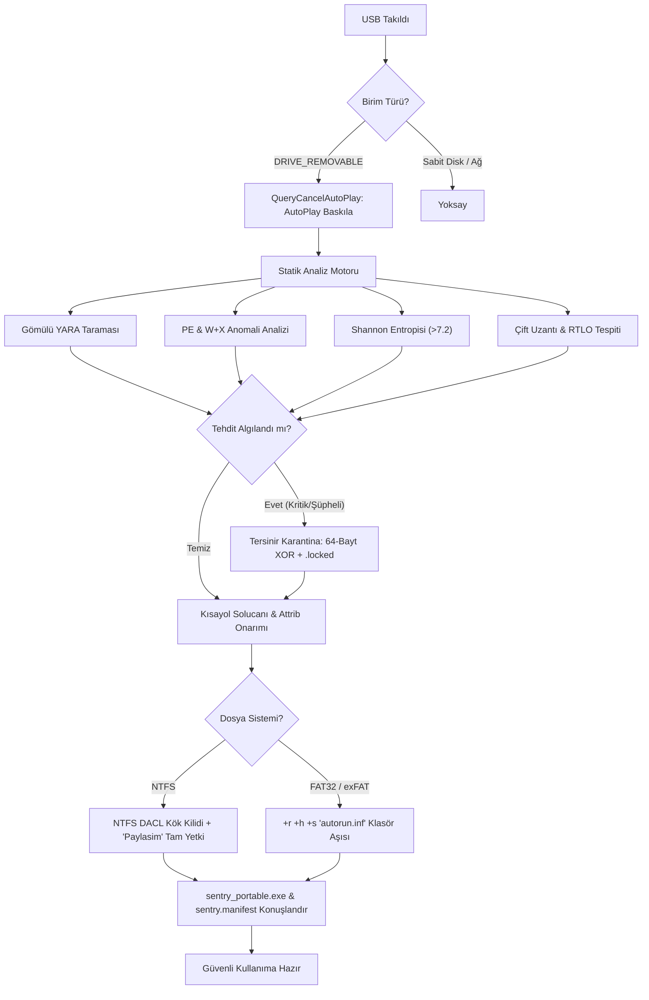

# Vectis (CoreSync USB Gatekeeper)

> **Ultra-Lightweight, Air-Gapped External Storage Protection & Offline Immunization Engine**  
> *Sıfır Ağ Bağımlılığı (Zero-Network Dependencies) • Saf Rust (Pure Rust / `windows-sys`) • Çevrimdışı Donanım Seviyesinde Koruma • Tek Parça Bağımsız İkili • Modern Slint GUI + Sistem Tepsisi*

[](https://github.com/bahadir-tkn/Vectis/actions)
[](LICENSE)
[](https://microsoft.com/windows)
[](https://www.rust-lang.org)
[](#air-gapped-güvenlik-felsefesi)
[](ARCHITECTURE.md)

---

## 📌 Proje Vizyonu ve Konumlandırma

**CoreSync USB Gatekeeper**, harici depolama aygıtları (USB flash bellekler, harici taşınabilir HDD/SSD) üzerinden yayılan siber tehditleri (kısayol solucanları, LNK dropper'lar, VBS/Autorun stager'ları, gizlenmiş/çift uzantılı PE ikilileri ve şifrelenmiş zararlı yükler) **işletim sistemi seviyesinde yakalamak, takılan ortamları dosya sistemi mimarisiyle bağışıklamak ve tersinir karantina altına almak** üzere tasarlanmış açık kaynaklı bir uç nokta nöbetçisidir.

### Temel Prensipler
- **Air-Gapped Güvencesi:** Kaynak kodda hiçbir ağ kütüphanesi (`reqwest`, `tokio::net`, raw socket, WinSock veya HTTP istemcisi) bulunmaz. İnternete asla erişmez ve veri sızdırmaz.
- **Sıfır C/C++ Çalışma Zamanı Bağımlılığı:** Harici DLL'lere (`MSVCRT.dll`, `libyara.dll`, `VCRUNTIME140.dll`) bağımlı değildir; saf Rust ve doğrudan Win32 API (`windows-sys`) çağrıları ile çalışır.
- **Ultra-Hafif Kaynak Tüketimi:** Olay güdümlü (event-driven) donanım kancası sayesinde arka planda **<10 MB RAM** ve **%0 CPU** tüketir. On-Demand modunda ise görev bitiminde **sistemde 0 process** bırakır.

---

## 🏛️ 3 Katmanlı Savunma Mimarisi

```
                           [Harici USB Bellek Takıldı]
                                        │
                                        ▼
┌───────────────────────────────────────────────────────────────────────────────┐
│ KATMAN 1: Host-Side Gatekeeper (Donanım Dinleyici & Mod Yönetimi)            │
│ • Win32 WM_DEVICECHANGE & DBT_DEVTYP_VOLUME Dinleyicisi                       │
│ • Sürücü Harfi Çözümleme (Bitmask Unitmask -> D:\, E:\)                      │
│ • QueryCancelAutoPlay ile Windows Gezgini Otomatik Açılışını Baskılama       │
│ • Çift Modlu Mimari: Sentry (<10 MB RAM, %0 CPU) / On-Demand (0 Process)      │
└───────────────────────────────────────┬───────────────────────────────────────┘
                                        │
                                        ▼
┌───────────────────────────────────────────────────────────────────────────────┐
│ KATMAN 2: Deep Static Analysis & Heuristic Engine (Çevrimdışı Tehdit Analizi)  │
│ • Gömülü Çevrimdışı YARA Motoru (8 Özelleştirilmiş USB Tehdit Kuralı)          │
│ • PE Başlık Analizcisi (MZ/PE Doğrulama, W+X Bellek Anomalisi, Packer Tespiti)│
│ • Shannon Entropi Heuristiği (>7.2 Eşikli Şifrelenmiş Yük Tespiti)            │
│ • Sahte Uzantı (Masquerading), Çift Uzantı ve Unicode RTLO (\u{202E}) Tespiti │
│ • FIPS 180-4 Saf Rust SHA-256 Kripto Motoru ile Streaming Özetleme           │
└───────────────────────────────────────┬───────────────────────────────────────┘
                                        │
                                        ▼
┌───────────────────────────────────────────────────────────────────────────────┐
│ KATMAN 3: USB Immunizer, Reversible Quarantine & Portable Rescue Agent       │
│ • NTFS Kök Dizin Kilidi: Everyone FILE_ADD_FILE kısıtlaması & 'Paylasim' alanı│
│ • FAT32/exFAT Korumalı (+r +h +s) 'autorun.inf' Klasör Aşısı & Kilitli Düğüm │
│ • Kısayol Solucanı ('Attrib') Onarıcısı: -h -s Onarımı & Sahte .lnk Silimi    │
│ • 64-Bayt Simetrik XOR Tersinir Karantina (.sentry_quarantine & quarantine.json)│
│ • Bağımsız Taşınabilir Kurtarma Ajanı (sentry_portable.exe & sentry.manifest)│
└───────────────────────────────────────────────────────────────────────────────┘
```

### Mermaid Akış Şeması



---

## 📋 Tamamlanan Fazlar ve Teknik Özellikler

### [FAZ 1] Donanım Dinleyici, Explorer Baskılama ve Çift Mod
- **Görünmez Win32 Olay Penceresi:** `CreateWindowExW` ve `RegisterClassExW` ile 0 boyutlu üst düzey pencere açarak işletim sistemi yayınlarını (`WM_DEVICECHANGE`) sıfır gecikmeyle yakalar.
- **Birim Çözümleyici:** `DEV_BROADCAST_VOLUME` bit maskesini (`dbcv_unitmask`) çözümleyerek sürücü harflerini (`D:\`, `E:\` vb.) doğrular; `GetDriveTypeW == DRIVE_REMOVABLE` denetimiyle sabit diskleri korur.
- **Explorer / AutoPlay Bastırma:** `RegisterWindowMessageW("QueryCancelAutoPlay")` kancası ile Windows Gezgini'nin virüslü USB'leri otomatik açmasını önler.
- **Sentry / On-Demand Çift Mod:** `config.json` üzerinden arka plan dinleme (`Sentry`) veya tek seferlik tarama yapıp derhal kapanan (`On-Demand - 0 Process`) modlar arasında geçiş yapılır.

### [FAZ 2] Kripto, YARA, PE Anomali ve Entropi Analizi
- **Saf Rust FIPS 180-4 SHA-256 Motoru:** 64 KB akış (streaming) tamponu ile gigabaytlarca boyuttaki dosyaları RAM tüketmeden anında özetler.
- **Gömülü YARA Kural Seti (`src/yara/rules/usb_threats.yar`):**
  1. `USB_Shortcut_Dropper_LNK`: LNK başlığı ve gizli powershell/cmd komutları (`-w hidden`, `-enc`).
  2. `USB_RaspberryRobin_LNK_Worm`: Raspberry Robin ve rundll32/msiexec LNK solucanları.
  3. `USB_VBS_JS_Worm_Dropper`: USB sürücülere yayılan VBScript ve JScript taşıyıcıları.
  4. `USB_Autorun_Malware_Inf`: Kök dizinde otomatik yürütme tetikleyen autorun direktifleri.
  5. `USB_Batch_Powershell_Stager`: Certutil, bitsadmin veya gizli batch stager scriptleri.
  6. `USB_RTLO_Filename_Spoofing`: Unicode `\u{202E}` (Right-to-Left Override) uzantı aldatmacaları.
  7. `USB_Suspicious_PowerShell_Encoded`: Base64 / gzip sıkıştırılmış PowerShell yükleri.
  8. `EICAR_Standard_Test_File`: Sentetik EICAR test imzası.
- **PE Başlık ve W+X Analizcisi:** Hem yazılabilir hem çalıştırılabilir (`IMAGE_SCN_MEM_WRITE | IMAGE_SCN_MEM_EXECUTE`) kabuk kodu (shellcode) alanlarını ve bilinen packer'ları (`UPX`, `ASPack`, `Themida`, `VMProtect`) deşifre eder.
- **Shannon Entropisi:** $H(X) = -\sum_{i=0}^{255} p(x_i) \log_2 p(x_i)$ formülüyle şifrelenmiş veya paketlenmiş ikilileri **>7.2 eşiğiyle** heuristic olarak yakalar.
- **Bütünlük Manifestosu (`sentry.manifest`):** Referans snapshot ile yabancı sistemden dönen USB arasındaki eklenen, değiştirilen ve silinen dosyaların mikrosaniyeler içinde diff raporunu üretir.

### [FAZ 3] Bağışıklama, İzin Yönetimi ve Tersinir Karantina
- **NTFS Kök Dizin DACL Kilidi:** Kök dizin izinlerini `D:P(A;OICI;FA;;;BA)(A;OICI;FA;;;SY)(A;;0x1200a9;;;WD)` SDDL'i ile kilitler. Standart kullanıcılar (Everyone) için `FILE_ADD_FILE` ve `FILE_ADD_SUBDIRECTORY` yetkilerini kaldırır; virüslerin kök dizine dosya bırakmasını donanımsal dosya sistemi seviyesinde engeller.
- **Tam Yetkili Güvenli Alan (`Paylasim`):** Kök dizin kilitlenirken içinde tam yetkili (`FILE_ALL_ACCESS`) `Paylasim` klasörü oluşturur.
- **FAT32 / exFAT Autorun Aşısı:** Kök dizinde silinemez `autorun.inf` adında +r +h +s nitelikli bir klasör ve içinde `sentry_vaccine.sys` kilitli düğümünü oluşturur.
- **Kısayol Solucanı ('Attrib') Onarıcısı:** Virüslerin orijinal klasörleri `attrib +h +s` yaparak gizleyip yerlerine koyduğu sahte `.lnk` dosyalarını siler, orijinal klasörleri görünür kılar.
- **64-Bayt Simetrik XOR Karantina:** Tespit edilen tehditleri 64-baytlık anahtarla şifreleyerek `.sentry_quarantine/<id>.locked` altına taşır; `quarantine.json` veritabanı tutar ve `--restore` ile %100 SHA-256 teyitli geri yükleme sağlar.

### [FAZ 4] Sentetik Tehdit Doğrulama, Bellek Denetimi & Taşınabilir Ajan
- **Sentetik Güvenlik Doğrulama Paketi (`--test-suite`):**
  - **EICAR Test İmzası Doğrulaması:** `.txt`, `.bat`, `.com` sentetik dosyaları ile Gatekeeper'ın YARA ve Heuristic motorunun %100 doğrulukta `[KRİTİK ZARARLI]` olarak yakalayıp karantinaya aldığını doğrular.
  - **Çift Uzantı & RTLO Simülasyonu:** `fatura.pdf.exe` ve RTLO (`\u{202E}`) karakterli tuzak dosyalarıyla karantina döngüsünü teyit eder.
  - **Kısayol Solucanı Simülasyonu:** Gizlenen klasörlerin (-h -s) görünür kılındığını ve sahte `.lnk` dosyalarının silindiğini doğrular.
  - **Dayanıklılık Testi:** Aşı klasörüne ve kilitli düğüme programatik yazma/silme denemesi yaparak işletim sistemi seviyesinde "Erişim Reddedildi" (Win32 Hata 5) aldığını doğrular.
  - **RAII Yaşam Döngüsü:** Test ortamını sıfır iz bırakacak şekilde otomatik temizler.
- **Win32 Handle ve Bellek Güvenliği (Audit & Hardening):**
  - RAII `LocalAllocGuard` ile `LocalFree` çağrıları garanti altına alınmıştır (sıfır sızıntı).
  - `DEV_BROADCAST_HDR` boyut denetimi ile bellek taşması riski elenmiştir.
  - Win32 API hata kodları (`0`, `INVALID_FILE_ATTRIBUTES`, `ERROR_VIRUS_INFECTED` 225) eksiksiz ele alınır.
- **Taşınabilir Kurtarma Ajanı (`sentry_portable.exe`):**
  - USB bağışıklandığında Gatekeeper binary'sinin kendisini USB'ye (`Paylasim` veya kök) kopyalar ve yanına anlık `sentry.manifest` bırakır.
  - Kullanıcı yabancı bir bilgisayara gittiğinde internete ihtiyaç duymadan doğrudan USB içinden kurtarma aracını çalıştırabilir.

---

## 🚀 Komut Satırı Kullanım Kılavuzu (CLI Reference)

```powershell
Vectis.exe [SEÇENEKLER]
```

| Komut Parametresi | Açıklama | Örnek Kullanım |
| :--- | :--- | :--- |
| *(Parametresiz)* | Modern Slint Grafik Arayüzünü (GUI) ve Sistem Tepsisini Başlatır. | `.\Vectis.exe` |
| `--test-suite [KLASÖR]` | Sentetik Güvenlik ve Tehdit Doğrulama Paketini (EICAR, Çift Uzantı, RTLO, Solucan, Aşı) çalıştırır. | `.\Vectis.exe --test-suite` |
| `--scan <SÜRÜCÜ>` | Sürücüyü tam güvenlik boru hattına sokar (Statik Analiz, Karantina, Attrib Onarımı, Bağışıklama, Kurtarma Ajanı). | `.\Vectis.exe --scan E:\` |
| `--immunize <SÜRÜCÜ>` | Sürücüyü bağışıklar (NTFS için Kök ACL kilidi + 'Paylasim' alanı; FAT için 'autorun.inf' aşı klasörü). | `.\Vectis.exe --immunize E:\` |
| `--deimmunize <SÜRÜCÜ>` | Sürücünün bağışıklığını kaldırır ve izinleri fabrika varsayılanına döndürür. | `.\Vectis.exe --deimmunize E:\` |
| `--deploy-rescue <SÜRÜCÜ>` | Sürücüye bağımsız kurtarma ajanını (`sentry_portable.exe`) ve anlık `sentry.manifest`i kopyalar. | `.\Vectis.exe --deploy-rescue E:\` |
| `--clean-shortcuts <SÜRÜCÜ>`| Gizlenen klasörleri kurtarır (`attrib -h -s`) ve zararlı kısayolları (`.lnk`) siler. | `.\Vectis.exe --clean-shortcuts E:\` |
| `--quarantine-list <SÜRÜCÜ>`| Sürücüdeki karantina havuzunda (`.sentry_quarantine`) bulunan izole dosyaları listeler. | `.\Vectis.exe --quarantine-list E:\` |
| `--restore <SÜRÜCÜ> <HEDEF>`| Karantinadaki dosyayı XOR şifresini çözüp SHA-256 teyidiyle orijinal konumuna kurtarır. | `.\Vectis.exe --restore E:\ fatura.pdf.exe` |
| `--snapshot <SÜRÜCÜ>` | Sürücüdeki tüm dosyaların SHA-256 özetini alarak referans `sentry.manifest` oluşturur. | `.\Vectis.exe --snapshot E:\` |
| `--diff <SÜRÜCÜ>` | Sürücüyü `sentry.manifest` ile karşılaştırarak eklenen, silinen ve değişen dosyaları raporlar. | `.\Vectis.exe --diff E:\` |
| `--rules` | Binary içine derlenmiş gömülü YARA kurallarını ve meta verilerini listeler. | `.\Vectis.exe --rules` |
| `--sentry` | Sentry modunu başlatır (Arka planda Win32 WM_DEVICECHANGE ile USB takılmasını bekler). | `.\Vectis.exe --sentry` |
| `--on-demand` | On-demand modunda takılı tüm çıkarılabilir USB aygıtlarını tek seferlik tarar ve çıkar (0 process). | `.\Vectis.exe --on-demand` |
| `--status` | Sistemdeki mantıksal diskleri, dosya sistemlerini ve bağışıklık durumlarını görüntüler. | `.\Vectis.exe --status` |
| `--help`, `-h` | Detaylı yardım mesajını ve kullanım örneklerini gösterir. | `.\Vectis.exe --help` |

---

## ⚙️ Yapılandırma (`config.json`)

Program dizininde yer alan yerel yapılandırma:

```json
{
  "version": "1.0.0",
  "background_monitoring": true,
  "auto_suppress_explorer": true,
  "enable_ntfs_immunization": true,
  "create_portable_rescue": true,
  "quarantine_folder": ".sentry_quarantine",
  "entropy_threshold": 7.2,
  "max_scan_file_size_mb": 64
}
```

- `background_monitoring`: `true` ise Sentry Modu (arka plan dinleyici); `false` ise On-Demand Modu (0 process).
- `auto_suppress_explorer`: USB takıldığında Windows Gezgini açılışını engeller (`QueryCancelAutoPlay`).
- `enable_ntfs_immunization`: Pipeline tetiklendiğinde otomatik bağışıklama yapar.
- `create_portable_rescue`: USB'ye `sentry_portable.exe` ve `sentry.manifest` bırakır.
- `entropy_threshold`: Şüpheli paketleyici/şifreleyici tespiti için Shannon entropi sınırı (Varsayılan: >7.2).
- `max_scan_file_size_mb`: Statik YARA taraması için dosya başına azami tampon boyutu (Varsayılan: 64 MB).

---

## 🛠️ Kaynak Koddan Derleme (Build from Source)

CoreSync USB Gatekeeper, Windows x64 platformunda saf Rust ile derlenir:

```powershell
# 1. Projeyi derleme
cargo build --release

# 2. Sentetik doğrulama testlerini koşturma
cargo test --release

# 3. Bağımsız Test Harness'ı doğrudan binary üzerinden çalıştırma
.\target\release\coresync-usb-gatekeeper.exe --test-suite
```

### Derleme Optimizasyonları (`Cargo.toml`)
Boyutu minimize etmek ve çalışma zamanı yükünü sıfırlamak için release profilinde şu ayarlar etkindir:
- `opt-level = "z"`: İkili dosya boyutunu azami düzeyde küçültür.
- `lto = true`: Link-Time Optimization ile ölü kodları tamamen temizler.
- `codegen-units = 1`: Derleme birimlerini birleştirerek tam optimizasyon sağlar.
- `panic = "abort"`: Hata durumunda unwind tablolarını kaldırarak binary boyutunu düşürür.
- `strip = true`: Hata ayıklama sembollerini ikili dosyadan arındırır.
- **Nihai Binary Boyutu:** ~530 KB (Tek parça bağımsız `.exe`).

---

## 🔒 Güvenlik Doğrulaması ve Tehdit Simülasyonu

Proje içindeki otomatik test takımı (`--test-suite`), harici tehdit senaryolarını izole sanal sürücü ortamında simüle eder:

```
[1/5] EICAR Test İmzası Doğrulaması   -> %100 Tespit, XOR İzolasyonu ve SHA-256 Restore Doğrulaması
[2/5] Çift Uzantı & RTLO Simülasyonu -> 'fatura.pdf.exe' & '\u{202E}' [KRİTİK ZARARLI] Tespiti
[3/5] Kısayol Solucanı & Attrib       -> +h +s Gizlenen Klasörlerin Onarımı & Sahte .lnk Silimi
[4/5] Autorun Aşısı & Dayanıklılık    -> Kilitli Aşı Klasörüne Yazma Denemesinde Win32 Hata 5 Engeli
[5/5] Taşınabilir Kurtarma Ajanı      -> sentry_portable.exe & sentry.manifest 0-Diff Bütünlük Doğrulaması
```

---

## 📄 Lisans

Bu proje **MIT Lisansı** ile lisanslanmıştır. Detaylar için [LICENSE](LICENSE) dosyasına bakınız.
